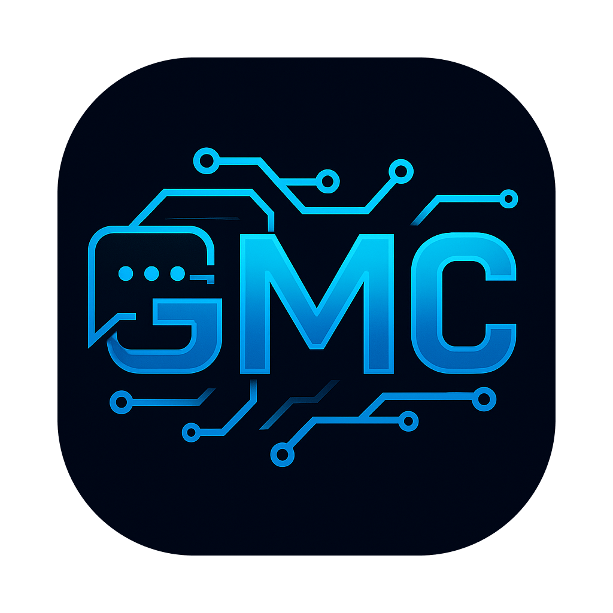

# gmc

<div align="center">
  
  <br />
  <p>Parallel worktrees for parallel AI agents — plus AI-generated commits.<br />A Git workflow CLI built for the AI coding era: spin up a worktree per agent, share <code>.env</code> and <code>node_modules</code> across them, and let an LLM write the commit when you're done.</p>
  <p>
    <a href="https://github.com/samzong/gmc/releases"></a>
    <a href="https://goreportcard.com/report/github.com/samzong/gmc"></a>
    <a href="https://github.com/samzong/gmc/blob/main/LICENSE"></a>
  </p>
</div>

## Installation

### Homebrew (macOS/Linux)

```bash
brew install samzong/tap/gmc
# or
go install github.com/samzong/gmc@latest
```

## Features

| Command | What it does |
| --- | --- |
| **Worktree — parallel AI development** | |
| `gmc wt clone <url> [--upstream <url>]` | Clone as `.bare/` + worktree layout, optionally register upstream |
| `gmc wt add <name> [-b <base>] [--sync]` | New worktree on a new branch |
| `gmc wt dup [N] [-b <base>]` | Fan out N sibling worktrees for parallel agents |
| `gmc wt promote <temp> <name>` | Rename a `.dup-N` branch to a permanent name |
| `gmc wt list` | List all worktrees in the family |
| `gmc wt switch` | Interactive switch between worktrees |
| `gmc wt remove <name> [-D]` | Delete worktree (and optionally its branch) |
| `gmc wt sync` | Pull the base branch up to date |
| `gmc wt share add <path>` | Share `.env` / `node_modules` / venv across worktrees |
| `gmc wt pr-review <pr-number>` | Spin up a worktree from a GitHub PR |
| `gmc wt prune` | Remove worktrees whose branches are merged |
| **Commit — AI message generation** | |
| `gmc` | Generate Conventional Commits message from staged diff |
| `gmc -a [paths...]` | Stage (all or given paths), then commit |
| `gmc --branch <desc>` | Generate a branch name, switch, then commit |
| `gmc --issue <N>` | Append `(#N)` to the subject |
| `gmc --prompt <text>` | Extra instruction for the LLM |
| `gmc --dry-run` | Generate but don't commit |
| `gmc -y` / `--no-verify` / `--no-signoff` | Auto-confirm / skip hooks / skip signoff |
| **Other** | |
| `gmc tag [-y]` | Suggest and create the next semver tag |
| `gmc init` | Interactive setup wizard |
| `gmc config set <key> <value>` / `gmc config get` | Manage config |
| `gmc --output json` | Machine-readable output for agents and CI |
| `gmc completion zsh\|bash\|fish` | Shell completion |

## Config

Config lives at `~/.config/gmc/config.yaml` (legacy `~/.gmc.yaml` still works; a project-level `.gmc.yaml` overrides global). Run `gmc init` for a guided setup, or set fields manually:

```bash
gmc config set apibase https://api.openai.com/v1
gmc config set apikey  sk-...
gmc config set model   gpt-4.1-mini
gmc config set role    "Backend Developer"
```

Custom prompt template: set `prompt_template` to a YAML file path with `{{.Role}}`, `{{.Files}}`, `{{.Diff}}` variables. See `docs/`.

## Shell completion

```bash
gmc completion zsh  > ~/.zsh/completions/_gmc
gmc completion bash > ~/.bash_completion.d/gmc
```

## License

This project is licensed under the MIT License - see the [LICENSE](LICENSE) file for details
